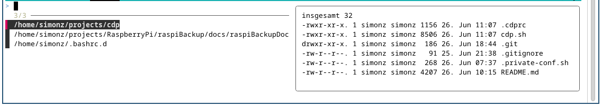

# cdp - A TUI directory/project changer with optional autostart script

This is a small *bash* function providing a helper tool for easily `cd`ing
into a target directory, selectable from a list presented by a powerful TUI.

Its name *cdp* is a shortcut of *"cd project"*.

The list of presented directories can be:

  - the contents of the maintained file '${PROJECTFILE}'
  - the alphabetically sorted directories in '${PROJECTDIR}/'
  - the 10 most recently used directories in '${PROJECTDIR}/'



The above environment variables can be set externally.  
If not set externally they are set in the script to the following defaults:

    PROJECTDIR=~/projects
    PROJECTFILE=~/.projects


## Autostart per project

If there is a file `.cdprc` in the target directory, that one is sourced.  
It's like an "autostart" feature for this directory/project.

Examples for `.cdprc` files see below.


## Usage

    cdp [filter string]
    cdp [option] [dir]

Without any parameters the complete list of saved directories is presented to
choose from. The optional filter string reduces that list to the matching
entries. (*fzf* is used for this.)

If the given filter string is "." (just a dot) no directory selection is
performed at all, the current directory is kept and any followup actions
are done, e.g. the .cdprc is searched for and optionally sourced.

There are additional features when called without options:

  - `Ctrl-E` to open the project file for editing and reload it afterwards
  - `Ctrl-R` to reload the projectfile
  - `left`/`right` to navigate the directory tree

The `left`/`right` navigation is also available when called with `-d`.


Options:

Options affecting the list of presented directories:

    -d  present sorted directories in '${PROJECTDIR}/' to choose from
    -D  present the 10 MRU directories in '${PROJECTDIR}/' to choose from

The following options are for administrative purposes:

    -e        edit '$PROJECTFILE'
    -i [dir]  insert given or current directory at '$PROJECTFILE's beginning
    -a [dir]  append given or current directory to '$PROJECTFILE'
    -r        edit rc file .cdprc in the current project directory
    -h        this help text

    --init    create example .cdprc and .private-conf.sh in the current directory


## Installation

This script is intended to be source'd only, and not executed directly.

Recommended: Source it in your `~/.bashrc`.


The program *fzf* (Fuzzy Finder, [see GitHub](https://github.com/junegunn/fzf)) is required.
Please install it. It should be available in almost every Linux Distribution.

Additionally *ripgrep* (rg) and *fdfind* (fd) are recommended
because they might be required in related scripts.
(And are useful for themselves too.)


## Example .cdprc files

### Add local bin directory to PATH
```
#!/usr/bin/env bash
#######################################
#
#  Project with tools in local ./bin/ directory
#
#######################################
[[ $PATH =~ ${PWD}/bin: ]] || export PATH=$PATH:${PWD}/bin:
```

### Define locally used functions/aliases

```
#!/usr/bin/env bash

echo -e "\n*** Define helpful functions and aliases:\n"

edit_by_status() {
    # some tricky script code providing a list of files
    # and calling an editor with them
}

alias vibs='edit_by_status'
alias vids='vimdiff -c "syntax off" {de,en}/src/SUMMARY.md'
```

For a real world example see project [raspiBackupDoc here at GitHub](https://github.com/framps/raspiBackupDoc).


### Unlock SSH keys for this project

```
#!/usr/bin/env bash

check_ssh_id() {
    IDFILE="$1"
    [ -f "$IDFILE" ] || return 1
    echo "$2"
    if ! ssh-add -T "$IDFILE" 2>/dev/null
    then
        ssh-add "$IDFILE"
    fi
    ssh-add -T "$IDFILE"
}

echo "*** Check/unlock SSH keys (and set possibly more private settings):"
echo ""

# Examples:
#    check_ssh_id  ~/.ssh/id_my_github    "Checking ssh key(s) for GitHub ..."
#    check_ssh_id  ~/.ssh/id_my_bitbucket "Checking ssh key(s) for Bitbucket..."
#
# But can/should be set to real values in .private-conf.sh for privacy reasons
# especially if this .cdprc file is tracked by git!
# Then .private-conf.sh can be easily set to be "ignored" in .gitignore.
[[ -f .private-conf.sh ]] && source .private-conf.sh

```

### Just print some infos when entering the directory

```
#!/usr/bin/env bash

cat <<EOF

*******************************************************************************

This project directory is for ...

There are some aliases defined as shown above.

The directory is tracked by git and is connected to the git repo listed below.

*******************************************************************************

EOF
```

### Activate Python virtual env

```
#!/usr/bin/env bash

. venv/bin/activate
```

